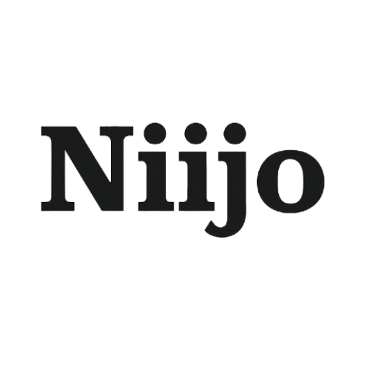

# Niijo

  
  
  **Empowering Nepal's Young Minds with AI Education**
  
  
  
  
  
  *Pre-Launch Phase - Courses launching August 2025*

---

## 🎯 Mission Statement

Introducing AI education to Nepal's school students, building foundational knowledge and critical thinking skills that will prepare the next generation for an AI-driven future.

## 📊 The Opportunity We're Addressing

Nepal's education system needs early AI literacy:

- **Limited AI awareness** among school students (grades 6-12)
- **Growing demand** for digital literacy and future-ready skills
- **Gap between traditional curriculum** and modern technology needs
- **Opportunity to build AI literacy** from an early age
- **Preparing students** for higher education and careers in technology

## 💡 Our Solution

We provide **age-appropriate, engaging AI education** for school students through structured courses designed for different grade levels, making AI accessible and understandable for young learners.

### 📚 Course Structure

| Grade Level | Course Focus | Duration | Target Skills | Status |
|-------------|--------------|----------|---------------|--------|
| **Grades 6-8** | AI Basics & Fun Applications • What is AI? • AI in Daily Life • Simple AI Tools • Creative Projects | 6 weeks | Foundation & Curiosity | 🔄 **Developing** |
| **Grades 9-10** | AI Tools & Applications • Understanding Machine Learning • AI Tools Exploration • Problem-Solving with AI • Digital Ethics | 8 weeks | Application & Analysis | 🔄 **Developing** |
| **Grades 11-12** | Advanced AI Concepts • Programming Basics • AI Project Development • Data Science Introduction • Career Pathways in AI | 10 weeks | Creation & Implementation | 🔄 **Developing** |

### 🎯 Key Features

- **Age-Appropriate Content**: Curriculum designed specifically for each grade level
- **Interactive Learning**: Hands-on activities, games, and practical exercises
- **Local Context**: Examples and projects relevant to Nepali students
- **Future-Ready Skills**: Building foundation for higher education and careers
- **Engaging Delivery**: Making AI education fun and accessible

## 👨‍💼 Founding Team

### Rajan Neupane - Co-Founder & Chief Academic Officer
- **Background**: Former World Bank Data Scientist
- **Education**: MSc in Artificial Intelligence
- **Expertise**: Educational Curriculum Design, AI/ML, Youth Education

### Mukesh Adhikari - Co-Founder & Chief Technology Officer
- **Background**: Former IBM Engineer
- **Expertise**: AI Systems, Educational Technology, Student Engagement Platforms
- **Focus**: Technology infrastructure and course delivery systems

## 📈 Current Status & Roadmap

### ✅ Foundation Phase (Completed)
- Market research and needs assessment
- Initial curriculum framework development
- Team formation and vision alignment
- Educational approach and methodology design

### 🔄 Development Phase (Current - July 2025)
- **Course Content Creation** for all three grade levels
- **Platform Development** - Learning management system setup
- **Pilot Program Planning** - Selecting initial schools/students
- **Instructor Training Materials** development

### 📅 Launch Phase (August 2025)
- **Pilot Launch** with select schools in Kathmandu
- **Student Registration** opens for all grade levels
- **First Cohorts Begin** - 20-30 students per grade level
- **Feedback Collection** and course refinement

### 🚀 Growth Phase (Q4 2025 - 2026)
- Scale to additional cities across Nepal
- Expand to 200+ students across all grade levels
- Develop advanced modules and supplementary materials
- Build partnerships with schools and educational institutions

## 🎓 Course Offerings

### **Grades 6-8: "AI Explorers"**
Perfect introduction to AI concepts through stories, games, and simple activities. Students discover how AI works in their daily lives and create their first AI-powered projects.

### **Grades 9-10: "AI Innovators"**
Deeper exploration of AI tools and applications. Students learn to use AI for problem-solving, understand the technology behind popular AI applications, and explore ethical considerations.

### **Grades 11-12: "AI Pioneers"**
Advanced preparation for higher education and careers. Students learn programming basics, develop AI projects, and explore pathways into technology careers.

## 🚀 Get Involved

### 🎓 For Students & Parents
Ready to give your child a head start in the AI era? Join our waitlist for early access and course updates.

**[Join Waitlist →](https://niijo.com)**

### 🏫 For Schools & Educators
Interested in bringing AI education to your institution? We're seeking partner schools for our pilot program.

**Email us:** `schools@niijo.com`

### 👨‍🏫 For Education Professionals
Help us shape AI education for Nepal's youth. We're looking for educators passionate about technology and student development.

**Email us:** `team@niijo.com`

### 💼 For Investors & Partners
Support the future of education in Nepal. Request our pitch deck and learn about partnership opportunities.

**Contact:** `partnerships@niijo.com`

## 🌟 Why AI Education Nepal?

- **Age-Appropriate Learning**: Carefully designed curriculum for each grade level
- **Future-Ready Skills**: Preparing students for tomorrow's opportunities
- **Local Relevance**: Content that connects with Nepali students' experiences
- **Expert Instruction**: Led by professionals with real-world AI experience
- **Early Advantage**: Give your child a competitive edge in the digital future

## 📞 Contact Information

**AI Education Nepal**  
Empowering Nepal's Young Minds with AI Education

---

🌐 **Website**: [niijo.io](https://niijo.io)  
💼 **LinkedIn**: [linkedin.com/company/Niijo](https://linkedin.com/company/niijo)  
📧 **General Inquiries**: team@niijo.com  
🏫 **School Partnerships**: schools@niijo.com  
🤝 **Business Partnerships**: partnerships@niijo.com

---

*© 2025 Niijo. All rights reserved.*

---

## 📄 Repository Information

**Status**: Private Repository - Pre-Launch Development Phase  
**Target Launch**: August 2025  
**Current Focus**: Curriculum Development & Pilot Program Preparation  
**Last Updated**: July 2025
